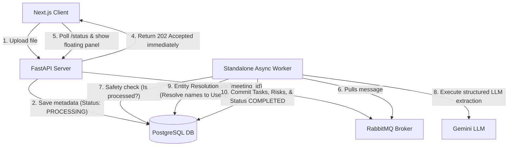

# Walkthrough: Complete Multi-Tenant Asynchronous Ingest & Processing System

We have successfully implemented and finalized all phases (Phase 1 to Phase 5) of the AI Meeting Agent product. The backend and frontend are now fully prepared for mentor evaluation.

---

## 🛠️ Complete System Overview

Here is a summary of the systems created and modified:



---

## 🔍 Detailed Component Updates

### 1. Ingestion Flow (Phase 2)
- Refactored `POST /upload` inside [app/fastapi_routes.py](file:///c:/Aniket%20Personal/EkamVistar%20Tasks/AI%20Meeting%20Agent/app/fastapi_routes.py) to extract the file hash immediately.
- Added helpers inside [app/database_service.py](file:///c:/Aniket%20Personal/EkamVistar%20Tasks/AI%20Meeting%20Agent/app/database_service.py) to look up duplicate hashes globally. If a duplicate exists, it inserts a new team mapping to `meeting_teams` and returns `200 OK` (no queueing).
- For new uploads, it saves the initial metadata as `PROCESSING`, publishes the meeting ID to RabbitMQ, and returns `202 Accepted` immediately.

### 2. Standalone Background Worker (Phase 3)
- Created the background worker script in [app/worker.py](file:///c:/Aniket%20Personal/EkamVistar%20Tasks/AI%20Meeting%20Agent/app/worker.py) running a pika-based BlockingConnection loop.
- Performs safety checks to avoid duplicate processing of completed transcripts.
- Performs **Entity Resolution**: Matches speaker names and task owners to database user records under the same `organization_id` (matching by lowercase first names first, then lowercase full names).
- Wraps all database writes (setting status to `'COMPLETED'`, inserting AI summary and title, speakers as participants, tasks, task assignees, and risks) into a single PostgreSQL transaction, falling back to status `'FAILED'` if any error occurs.

### 3. Next.js Async Interface & Scoping (Phase 4)
- Modified [frontend/src/lib/api.js](file:///c:/Aniket%20Personal/EkamVistar%20Tasks/AI%20Meeting%20Agent/frontend/src/lib/api.js) to accept and supply request-scoped `organizationId`, `userId`, and `teamId` variables in headers and parameters.
- Implemented `/meetings/{id}/status` polling endpoint in Next.js to fetch background progress every 5 seconds.
- Created a top-right floating progress panel inside [frontend/src/app/layout.js](file:///c:/Aniket%20Personal/EkamVistar%20Tasks/AI%20Meeting%20Agent/frontend/src/app/layout.js) displaying currently processing transcripts. The page auto-refreshes using state key updates as soon as the polling detects status changes to `COMPLETED` or `FAILED`.
- Appended styling rules in [frontend/src/app/globals.css](file:///c:/Aniket%20Personal/EkamVistar%20Tasks/AI%20Meeting%20Agent/frontend/src/app/globals.css) for the floating panel and loading animations.

### 4. Advanced Semantic Queries (Phase 5)
- Updated the database schema instructions for the LangGraph agent in [app/query_service.py](file:///c:/Aniket%20Personal/EkamVistar%20Tasks/AI%20Meeting%20Agent/app/query_service.py) with the new `task_assignees` schema.
- Added explicit SQL JOIN hints to ensure the LLM correctly matches task assignees to database users when users search things like *"Show tasks assigned to John"*.

---

## 🚀 How to Run and Verify the Project

To build and launch all services, run the following command in the project root:

```bash
docker-compose up --build
```

### Steps to Verify the Async E2E flow:
1. Access the web dashboard at `http://localhost:3000`.
2. Click **Upload Transcript** in the sidebar. Drop a new `.txt`, `.pdf`, or `.vtt` file.
3. Observe:
   - The modal closes immediately and you are redirected to the dashboard.
   - A floating panel appears in the top-right: **AI Processing (1) - [filename]**.
   - In terminal logs, you will see `meeting_agent_worker` container picking up the task, executing LLM extraction, and transactionally writing it.
   - Upon completion, the panel flashes a success notification, clears itself, and the dashboard **auto-refreshes** to show the new meeting, tasks, and risks!
